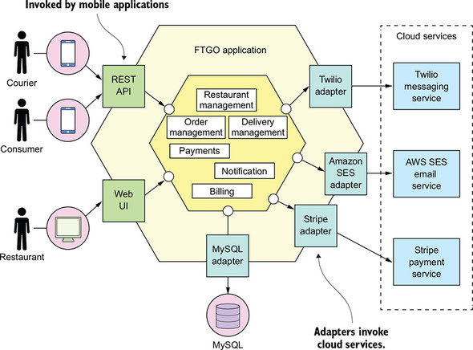
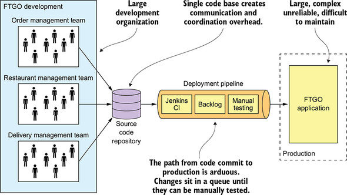

# Design and Architecture (Cliche of cliche)

## Architecture

### Monolithe vs MicroService

#### Monolithe

##### Good: 

- Simple to develop—IDEs and other developer tools are focused on building a single application.
- Easy to make radical changes to the application—You can change the code and the database schema, build, and deploy.
- Straightforward to test—The developers wrote end-to-end tests that launched the application, invoked the REST API, and tested the UI with Selenium.
- Straightforward to deploy—All a developer had to do was copy the WAR file to a server that had Tomcat installed.
Easy to scale—FTGO ran multiple instances of the application behind a load balancer.

##### Bad: Monolithic hell

- 

ref: book: Microservices Patterns By Chris Richardson

## Development

### What is `High Cohension, Low Coupling`?

What is `High Cohension`?
    
What is `Low Couping`?

ref: [StackOverflow: what does low in coupling and high in cohension mean](https://stackoverflow.com/questions/14000762/what-does-low-in-coupling-and-high-in-cohesion-mean)

### What is IOC?

IOC is short for *Inverse Of Control*.

- [Wikipedia: Inversion of Control](https://en.wikipedia.org/wiki/Inversion_of_control)

Notice that **Dependency Injection** and **IOC** are closely related conceptions. Here is an important article written by Martin Fowler in 2004:
- [Martin Fowler: Inversion of Control Containers and the Dependency Injection pattern](https://martinfowler.com/articles/injection.html) 

For Golang developer like me, IOC seems to be a little bit heavy. However, there are also some IOC frameworks(dependency injection frameworks) like [google/wire](https://github.com/google/wire) and [uber-go/fx](https://github.com/uber-go/fx).

### KISS:
Short for "keep it simple, stupid"

### CAP theorem:
C: Consistency -> Every node sees the same data even when concurrent updates occur

A: Availability -> All requests receive responses on whether it success or not

P: Partition Tolerance -> The system will keep operating even if there's a partition in communication between 2 different nodes

In real practice, partition is always going to happen, thus P is a must to satisfy requirement.

### 
